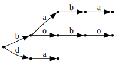

## Автомати и низове

### Автомати
Ще си измислим структура от данни, представяща краен автомат.
Тя ще представлява асоциативен списък с три елемента - `delta`,
`start` и `final`.

Стойността зад ключа `delta` наричаме "функция на преходите",
и тя сама по себе си е асоциативен списък.
Ключовете на функцията на преходите са двойки, където:

- първият елемент на двойката-ключ е име на състояние
- вторият елемент на двойката-ключ е буква (символ)
- стойността е име на друго състояние

Всеки елемент на `delta` описва преход от състояние с някоя буква
в друго състояние.

Стойността зад ключа `start` е името на началното състояние.
Стойността зад ключа `final` е списък от имената на финалните състояния.

Например, така може да представим автомат, разпознаващ езика `(ba)*`:

```scheme
(define baba-automaton
  (list
   (cons 'delta
         (list
            (cons (cons 'gosho 'b) 'pesho)
            (cons (cons 'gosho 'a) 'err)
            (cons (cons 'pesho 'b) 'err)
            (cons (cons 'pesho 'a) 'gosho)
            (cons (cons 'err 'a) 'err)
            (cons (cons 'err 'b) 'err)))

   (cons 'start 'gosho)
   (cons 'final (list 'gosho))))
```


- Зад. 1: Напишете функция `(apply-delta delta state symb)`, която по подадени
функция на преходите, състояние и буква връща следващо състояние

- Зад. 2: Напишете функция `(apply-delta* delta state word)`, която по подадени
функция на преходите, състояние и списък от букви връща следващо състояние,
което се получава като извършим преходите за всички букви в списъка

- Зад. 3: Напишете функция `(accepts-word? automaton word)`, която по подадени
автомат връща `#t` или `#f`, в зависимост от това дали автоматът разпознава думата


### Низове

Scheme поддържа "символни низове" (strings) - обекти, чиито елементи са графеми (characters / graphemes).
Синтаксисът за конструиране на графема е с диез и обратна наклонена черта: `#\c`, а този
за конструиране на низ е с двойни кавички: `"foo bar"`.

Да разгледаме следните функции от стандартната библиотека:

- `(make-string n c)` - Създава низ със дължина n, който се състои от повторения на графемата c
- `(string-length str)` - Връща дължината на подадения низ
- `(string-ref str k)` - Връща символът на позиция k в дадения низ
- `(string-append str ...)` - Връща нов низ, който се получава при долепяне на подадените низове

За повече информация, разгледайте [документацията](https://schemers.org/Documents/Standards/R5RS/HTML/r5rs-Z-H-2.html#%_toc_%_sec_6.3.5).

- Зад. 4: Да променим представянето на автомат от по-горе, така че вместо символи и списъци от символи
да използва графеми и низове

Напишете следните функции:

- Зад. 5: `(str-chr? str c)` - Проверява дали графемата `c` се съдържа в низа `str`
- Зад. 6: `(str-sub str a b)` - Връща нов низ, който е частта от `str`, намираща се между позициите `a` и `b`.
- Зад. 7: `(string->list str)` - Връща списък от графемите на `str`
- Зад. 8: `(str-str? needle haystack)` - Ако низът `needle` се съдържа в низа `haystack`, връща първата позиция, на която се среща. Иначе, връща `#f`.


### Префиксно дърво

Да разгледаме друга структура от данни - префиксно дърво (trie).

Едно префиксно дърво представлява асоциативен списък, на който ключовете са букви (графеми),
а стойностите са други префиксни дървета.

Казваме, че една дума е част от езика на едно префиксно дърво, ако съществува път от корена
до листо на дървото, минаващ по буквите на думата.

Ето пример за префиксно дърво, разпознаващо думите `baba`, `bobo` и `da`:
```scheme
(define bobo-trie
    (list
        (cons #\b
            (list
                (cons #\a
                    (list
                        (cons #\b
                            (list
                                (cons #\a
                                    (list))))))
                (cons #\o
                    (list
                        (cons #\b
                            (list
                                (cons #\o
                                    (list))))))))
        (cons #\d
            (list
                (cons #\a
                    (list))))))
```


- Зад. 9: Напишете функция `(trie-words trie)`, която връща списък от всички думи,
които се разпознават от даденото префиксно дърво
- Зад. 10: Напишете функция `(trie-add word trie)`, която добавя дума към езика на
дадено префиксно дърво

