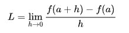

# Седмица 03 - Функции от по-висок ред

## Задача 01 - Композиция
Напишете функция `compose`, която приема две функции на 1 параметър и връща нова функция - тяхната композиция.

### Пример:
```scheme
((compose (lambda (x) (+ x 5)) 
          (lambda (x) (* x 3))) 
  4) ; -> 17
```

## Задача 02 - Комбинация
Напишете функция `S`, която приема двуместна функция `f` и едноместна функция `g`. Функцията да връща нова функция, която прима един аргумент `x`, и пресмята `f(x, g(x))`.

### Пример:
```scheme
((S + (lambda (x) (* x x))) 3) ; -> 9
```

## Задача 03 - Многократна композиция
Напишете функция `repeat`, която приема функция `f` и число `n`. Функцията да връща нова функция, която е `n`-кратната композоция на `f`.

### Пример:
```scheme
((repeat (lambda (x) (+ x 1)) 8) 4) ; -> 12
```

## Задача 04 - Производна
Напишете функция `derive`, която приема функция, и връща нейната производна. Използвайте следната формула, като изберете достатъчно малко `h`: 



### Пример:
```scheme
((derive (lambda (x) (* x x))) 4) ; -> 8.000000999430767 при h=0.000001
```

## Функцията `accumulate`
За всяка от следващите задачи използвайте само `accumulate` или `accumulate-iter`, без да ползвате пряка рекурсия.
```scheme
(define (accumulate operation null-value begin end term next)
  (if (> begin end) null-value
      (operation (term begin)
                 (accumulate operation null-value (next begin) end term next))))

(define (accumulate-iter operation null-value begin end term next)
  (if (> begin end) null-value
      (accumulate-iter operation
                       (operation null-value
                                  (term begin))
                       (next begin)
                       end term next)))
```

## Задача 05 - Сума на нечетни квадрати
Напишете функция `sum-odd-squares`, която приема 2 числа - `a` и `b`. Функцията да пресмята сумата на нечетните квадрати на числата в интервала [a, b].

### Пример:
```scheme
(sum-odd-squares 1 10) ; -> 165
```

## Задача 06 - Биномен коефициент
Напишете функция `binomial`, която приема 2 числа - `n` и `k`. Функцията да пресмятa $\binom{n}{k}$.

### Пример:
```scheme
(binomial 8 3) ; -> 56
```

## Задача 07 - Максимална стойност
Напишете функция `argmax`, която приема функция `f` и две числа - `a` и `b`. Функцията да намира това число `x` в интервала [a, b], за което f(x) има най-голяма стойност.

### Пример:
```scheme
(argmax (lambda (x) (remainder x 7)) 45 50) ; -> 48
```

## Задача 08 - Истинност
Напишете функция `all?`, която приема предикат и две числа - `a` и `b`. Функцията да проверява дали предиката е истина за всички числа в интервала [a, b].

## Бонус:
Напишете функция `any?`, която е същата като `all?`, но проверява дали `някое` от числата изпълнява предиката.

### Пример:
```scheme
(all? even? 1 10) ; -> #f
(all? (lambda (z) (< z 11)) 1 10) ; -> #t
```

## Задача 09 - Брой двойки с равен сбор
Напишете функция `count-pairs`, която приема 3 числа - `a`, `b` и `n`. Функцията да намира броя на двойките числа в интервала [a, b], които имат сбор точно равен на `n` (броим двойките (3, 7) и (7, 3) като една).

```scheme
(count-pairs 1 10 14) ; -> 4
```

## Задача 10 - Седмица 02
Решете задачи 02, 03, 07 от Седмица 02 чрез `accumulate` или `accumulate-iter`.