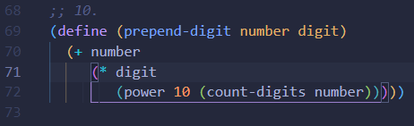

# Упражнение 2


---

# Бонус готинийки (`#lang racket`)

## Не всички скоби е задължително да са кръгли
Например, съвсем валиден е и следният код:

```scheme
(define (compare-to-1 n)
  (cond
    [(> n 1) "greater than 1"]
    [(= n 1) "equal to 1"]
    [else    "less than 1"]))

(define [1+ x] {+ x 1})
```

Има ситуации, често например при `cond`, `let{,*,rec}` (за тях другия път), дори и при `define` (въпрос на вкус), където използването на различни двойки скоби може значително да допринесе към четимостта на кода.

> Позволени скоби са `()`, `[]` и `{}`.

## За ценителите на VSCode

Както бяхме споменали предния път, сносна алтернатива на DrRacket може да бъде и VSCode с малко адекватен setup. По наша рецепта:

- Теглим extension-а [`Magic Racket`](https://marketplace.visualstudio.com/items?itemName=evzen-wybitul.magic-racket) (който от 07.2023 дори ship-ва с language server integration), така че да можем да се насладим на пълното изживяване от един културен език.
- Опционално (лично аз и Павел съветваме), ако искате и малко помощ със скобките, може да се възползвате от следните настройки на VSCode (в `settings.json`, при мен са глобални):

```jsonc
    // за готини линийки, очертаващи блока между отварящата и затварящата скоба, в който се намира понастоящем курсора
    "editor.guides.bracketPairs": true,
    // за алтерниращи цветове на двойките скоби (адски много помага за лесното разграничаване на отделните блокове)
    "editor.bracketPairColorization.enabled": true,
    // тук изброявате кои да са ви различните цветове (това е гамата, която аз [Давид] ползвам)
    "workbench.colorCustomizations": {
        "editorBracketHighlight.foreground1": "#5caeef",
        "editorBracketHighlight.foreground2": "#dfb976",
        "editorBracketHighlight.foreground3": "#c172d9",
        "editorBracketHighlight.foreground4": "#4fb1bc",
        "editorBracketHighlight.foreground5": "#97c26c",
        "editorBracketHighlight.foreground6": "#abb2c0",
        "editorBracketHighlight.unexpectedBracket.foreground": "#db6165"
    },
```

- Много опционално: ако много не ви харесва color theme-а, с който `Magic Racket` highlight-ва отделните семантични единици във вашия scheme код, съществува компромисен (поради липса на директна настройка на Magic Racket) вариант чрез екстеншъна [`Theme by language`](https://marketplace.visualstudio.com/items?itemName=jsaulou.theme-by-language). Може и да ви се стори малко странно да се сменя theme-а на целия редактор от файл на файл, но си го разцъкайте и преценете.

    Конкретно за `.rkt` и `.scm` файлове, ние ползваме theme-a `Tokyo Night (storm)`. Но може да си харесате каквото ви душа желае.

---

Резултат от цялата работа:



# Рекурсия

  Вече констатирахме, че всички са поне втори курс, така че знаете какво е рекурсия и можем да си спестим базовите обясняванки.

  Скачаме направо на интересното.

## Примитивна vs. опашкова рекурсия

Нека разгледаме $n!$

```scheme
(define (factorial n)
  (if (= n 0)
    1
    (* n (factorial (- n 1)))))
```

Aко бележим `factorial` с `f`, то изчислителният процес на `(f 5)`` ще изглежда така:

```scheme
;; (f 5)
;; (* 5 (f 4))
;; (* 5 (* 4 (f 3)))
;; (* 5 (* 4 (* 3 (f 2))))
;; (* 5 (* 4 (* 3 (* 2 (f 1)))))
;; (* 5 (* 4 (* 3 (* 2 (* 1 (f 0))))))
;; (* 5 (* 4 (* 3 (* 2 (* 1 1)))))
;; (* 5 (* 4 (* 3 (* 2 1))))
;; (* 5 (* 4 (* 3 2)))
;; (* 5 (* 4 6))
;; (* 5 24)
;; 120

;; памет: O(n)
;; време: О(n)
```

Това е същински рекурсивен процес (примитивна рекурсия), защото има отложените операции. Можем обаче да се справим и по-добре, като пренапишем с опашкова рекурсия...


```scheme
;; ... използвайки вложена дефиниция:
(define (factorial-iter n)

  (define (iter product i)
    ; тук ползваме допълнителния аргумент като
    ; допълнителна променлива, в която натрупваме резултата
    (if (zero? i)
      product
      ; Тук изчислението се случва в аргументите
      (iter (* i product)
            (- i 1))))

  ; Извикваме помощната функция
  (iter 1 n))
```

Вече изчислителният процес изглежда така:

```scheme
;; (factorial-iter 5)
;; (iter 1   5)
;; (iter 5   4)
;; (iter 20  3)
;; (iter 60  2)
;; (iter 120 1)
;; (iter 120 0)
;; 120

;; време: O(n)
;; памет: O(1)
```

Това е линеен итеративен процес заради липсата на отложени операции, или още познат като опашкова рекурсия.

Scheme третира опашковата рекурсия като итерация. Ако всички рекурсивни извиквания в една функция са опашкови, тя генерира линеен итеративен процес.

---

Нека разгледаме още по-жесток пример: числа на фибоначи.

```scheme
;; Тази реализация поражда дървовиден рекурсивен процес
(define (fib n)
  (if (< n 2)
    n
    (+ (fib (- n 1))
       (fib (- n 2)))))

;; време: O(2^n)
;; памет: O(2^n)
```

А можем ли да го направим итеративно?

Да, с динамично програмиране.

Ще намираме числата на фибоначи последователно и ще помним само предходните две. Така няма да трябва да ги изчисляваме всеки път, когато ни потрябват.

```scheme
(define (fib-iter n)
  (define (iter n1 n2 i)
    (if (zero? i)
      n2
      (iter n2
            (+ n1 n2)
            (- i 1))))
  (iter 0 1 n))

;; Нека видим разликата във времето за изпълнение:
;; (time (fib 42))
;; (time (fib-iter 42))
```

Тогава защо изобщо бихме използвали примитивна рекурсия, вместо опашкова (итерация)?

# Задачи

1. Дефинирайте функция `(sum-digits n)`, която смята сумата от цифрите на числото $n$.

```scheme
(sum-digits 123) ;; => 6
```

2. Дефинирайте функция `(count-divisors n)`, която връща броя на делителите на числото $n$.

```scheme
(count-divisors 6) ;; => 4 ; делителите на 6 са 1,2,3,6
```

3. Дефинирайте предикат `(prime? n)`, който определя дали $n$ е просто число.

```scheme
(prime? 1000000007) ;; => #t
```

4. Дефинирайте предикат `(increasing-digits? n)`, който определя дали цифрите в записа за числото $n$ са подредени във възходящ ред

```scheme
(increasing-digits 123) ;; => #t
(increasing-digits 132) ;; => #f
```

5. Дефинирайте предикат `(ends-with? n k)`, който проверява дали числото $n$ завършва с числото $k$.

```scheme
(ends-with? 152352363123 2363123) ;; => #t
(ends-with? 152352363123 3023)    ;; => #f
```

  - В допълнение, може да дефинирате предикат `(automorphic? n)`, който проверява дали $n$ е автоморфно. Едно число е _автоморфно_, ако квадратът му завършва на него.

```scheme
(automorphic? 4)  ;; => #f
(automorphic? 5)  ;; => #t
(automorphic? 6)  ;; => #t
(automorphic? 11) ;; => #f
```

6. Дефинирайте предикат `(perfect? n)`, която проверява дали дадено естествено число е съвършено.

> **NOTE**: Съвършени числа са [тези](https://oeis.org/A000396), за които сумата на всичките им делители (без самото число) е равна на същото число.

```scheme
(perfect? 33550336) ;; => #t
(perfect? 8126) ;; => #f
```

7. Дефинирайте функция `(binary-to-decimal n)`, която по дадено число в двоична бройна система, връща същото число в десетична бройна система

```scheme
(binary-to-decimal 101) ;; => 5
```

8. Дефинирайте функция `(decimal-to-binary n)`, която по дадено число в десетична бройна система, връща същото число в двоична бройна система

```scheme
(decimal-to-binary 5) ;; => 101
```
