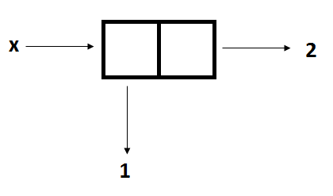

# Упражнение 4


---
# Обясняванки

[Достатъчно чудесни от миналата година ❤️](https://github.com/triffon/fp-2022-23/tree/main/exercises/inf2/04), така че с точност до преформатиране сме ги изкопирали блажено.

## Quote

```scheme
;; оценката на (quote <израз>) е самият <израз>
(+ 1 2) ;; => 3
(quote (+ 1 2)) ;; => (+ 1 2)

;; алтернативен запис на quote
'(+ 1 2) ;; => (+ 1 2)
```

## Наредени двойки

Съставен тип данни, който реализира наредена двойка `(A . B)`, oбразувана от две произволни стойности.



```scheme
;; cons образува наредена двойка от оценките
;; на подадените му изрази
(cons 1 2) ;; => '(1 . 2)

;; наредена двойка от оценките на 1 и #t - '(1 . #t)
(cons 1 #t)

;; наредена двойка от оценките на 1 и (+ 2 3) - '(1 . 5)
(cons 1 (+ 2 3))

;; използваме quote, за да дефинираме наредената двойк
(define x '(1 . 2)) ;; => '(1 . 2)

;; car връща първия елемент от наредената двойка
(car x) ;; => 1

;; cdr връща втория елемент от наредената двойка
(cdr x) ;; => 2

;; предикатът pair? проверява дали подаденият му
;; аргумент е наредена двойка
(pair? x) ;; => #t
```

Може някой от елементите на наредената двойка да е друга наредена двойка (да ги влагаме).


## Списъци

Рекурсивна дефиниция:

  - Празният списък `()` е списък
  - `(h . t)` е списък ако `t` е списък
      - `h` — глава на списъка (head)
      - `t` — опашка на списъка (tail)

```scheme
;; eквивалентни записи
(cons 1 (cons 2 (cons 3 '()))) ;; => '(1 2 3)
'(1 . (2 . (3 . ())))          ;; => '(1 2 3)
'(1 2 3)                       ;; => '(1 2 3)
(list 1 2 3)                   ;; => '(1 2 3)

;; списъците могат да съдържат различни типове данни
'(1 \e "string" (lambda (x) (+ x 1)) #t)

(car '(1 2 3)) ;; => 1
(cdr '(1 2 3)) ;; => '(2 3)

;; eквивалентни записи
(car (cdr '(1 2 3))) ;; => 2
(cadr '(1 2 3))      ;; => 2

;; eквивалентни записи
(cdr (cdr '(1 2 3))) ;; => '(3)
(cddr '(1 2 3))      ;; => '(3)

(car (cdr (cdr '(1 2 3)))) ;; => 3
(cdr (cdr (cdr '(1 2 3)))) ;; => '()
```

## Вградени функции за работа със списъци

```scheme
;; проверява дали списъкът е празен
(null? '(1 2 3)) ;; => #f
(null? '())      ;; => #t

;; проверява дали подаденият аргумент е списък
(list? '(1 2 3)) ;; => #t
(list? '(1 . 2)) ;; => #f

;; построява списък с оценките на подадените му аргументи
(list 1 (+ 1 1) 3) ;; => '(1 2 3)
;; сравнете със следния запис
'(1 (+ 1 1) 3)     ;; => '(1 (+ 1 1) 3)

;; връща дължината на списъка
(length '(1 2 3)) ;; => 3

;; конкатенира аргументите си в нов списък
(append '(1 2 3) '() '(4 5)) ;; => '(1 2 3 4 5)

;; обръща наредбата на елементите в списъка
(reverse '(1 2 3)) ;; => '(3 2 1)

;; проверява дали подаденият елемент се среща в списъка
(member 2 '(1 2 3 4)) ;; => '(2 3 4)
(member 5 '(1 2 3 4)) ;; => #f
```

## Линейно обхождане на списъци

```scheme
;; пример - функция, която намира сумата на
;; елементите на даден списък с числа
(define (sum lst)
  (if (null? lst)
      0
      (+ (car lst) (sum (cdr lst)))))

(sum '(1 2 3)) ;; => 6
```

Нищо ново тук! Oтново имаме:

- дъно - празен ли е списъкът
- рекурсивно извикване с "опашката" на списъка (списъка без първия си елемент)

## =, eq?, eqv? и equal?

[Отговор в stackoverflow с примери](https://stackoverflow.com/questions/16299246/what-is-the-difference-between-eq-eqv-equal-and-in-scheme)

TL-DR

- използваме `=` когато работим с числа
- използваме `eqv?` когато работим с прости типове
- използваме `equal?` когато работим и със списъци
- не използваме `eq?`, oсвен ако знаем какво правим (а ние не знаем)

Ако скоростта не е фактор, най-безопасно е да използваме `equal?`.

# Задачи

1. Дефинирайте функция `(len l)`, която намира дължината на списъкa `l`:

```scheme
(len '(1 2 3))     ;; => 3
(len (list))       ;; => 0
(len (cons 1 '())) ;; => 1
```

2. Дефинирайте функция `(any? p l)`, която проверява дали съществува елемент в `l`, за който
е изпълнен предикатът `p`:

```scheme
(any? odd? '(1 2 3 4 5)) ;; => #t
(any? odd? '(2 4 6))     ;; => #f
```

  - Дефинирайте аналогичния предикат `(all? p l)` чрез `any?`

3. Дефинирайте функция `(member? x l)`, която проверява дали елементът `x` се съдържа в списъка `l`:

<details style="margin-left:50px">
  <summary>Хмхм...?</summary>
  Какво значи "съдържа"???
</details>

```scheme
(member? "test" '(1 "test" 3 4)) ;; => '("test" 3 4)
(member? 5 '(1 "test"  3 4))     ;; => #f
```

4. Дефинирайте функция `(at n l)`, която връща елемента, намиращ се на позиция `n` (броим от 0)
в списъка `l`, или `#f`, ако позицията е извън списъка:

```scheme
(at 0 '(1 2 3)) ;; => 1
(at 3 '(1 2 3)) ;; => #f
```

5. Дефинирайте функция `(map f l)`, която прилага `f` върху всеки елемент на списъка `l`:

```scheme
(map (lambda (x) (+ x 1)) '(1 2 3)) ;; => '(2 3 4)
```

6. Дефинирайте функция `(filter p l)`, която съставя нов списък, съдържащ само елементите на `l`, за които е изпълнен предикатът `p`:

```scheme
(filter odd? '(1 2 3 4 5)) ;; => '(1 3 5)
```

7. Дефинирайте функция `(push x l)`, която добавя елемента `x` на края на списъка `l`:

```scheme
(push 5 '(1 2 3 4)) ;; => '(1 2 3 4 5)
(push #f '()) ;; => '(#f)
```

8. Дефинирайте функция `(reverse l)`, която връща списък с елементите на `l` в обратен ред:

```scheme
(reverse '(1 2 3)) ;; => '(3 2 1)
```

9. Дефинирайте функция `(insert x n l)`, която вкарва елемента `x` на позиция `n` в списъка `l` (ако `n` е след края на `l`, вкарваме `x` накрая):

```scheme
(insert 3 2 '(1 2 4 5)) ;; => '(1 2 3 4 5)
(insert 'ne6to 10000 '(ni6to)) ;; => '(ni6to ne6to)
```

10. Дефинирайте функция `(range a b)`, която генерира целочисления интервал `[a, b]`:

```scheme
(range 1 10) ;; => '(1 2 3 4 5 6 7 8 9 10)
(range 0 0) ;; => '(0)
(range 3 1) ;; => '()
```

11. Дефинирайте функция `(sum l)`, която намира сумата на елементите в списък

```scheme
;; Gauss approves
(sum (range 0 100)) ;; => 5050
```

12. (**БОНУС** 1,5т.) Дефинирайте функция `(reduce op init l)`, която пресмята `(op l[0] (op l[1] (op l[2] ... (op l[n] init)...)))` (ако имаме подаден празен списък, резултатът е `init`).

  - (0.5т. за всяка) Дефинирайте чрез `reduce` следните функции:
    - `map` от 5. задача;
    - `filter` от 6. задача;
    - `sum` от 10. задача.
