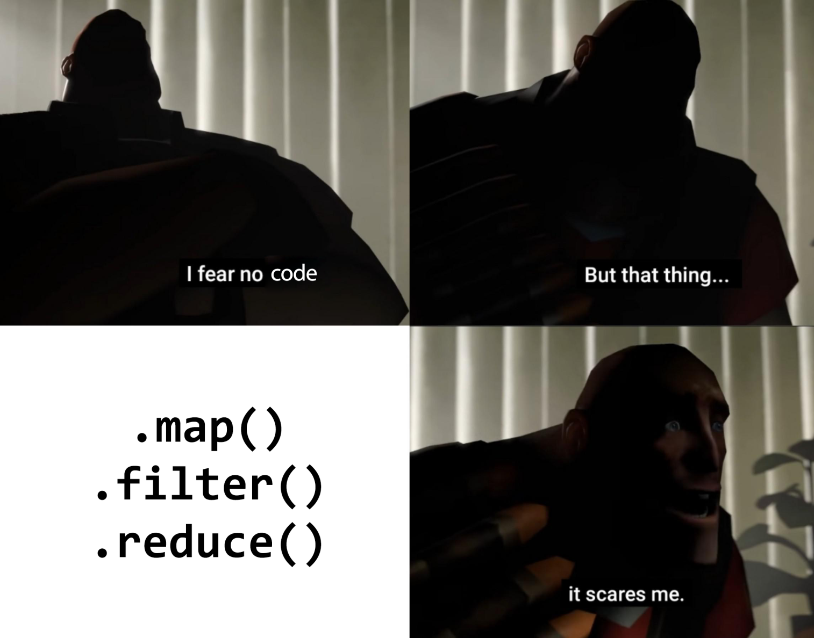

# Упражнение 6



---

# От миналото упражнение (по-миналата седмица)

Задачата за точици беше да имплементирате следната функция:

```scheme
(define (reduce op init l)
  (if (null? l)
      init
      (op (car l)
          (reduce op
                  init
                  (cdr l)))))
```

Както и да реимплементирате три други функции чрез нея, а именно `map`, `filter` и `sum` (няма да ги пляскаме тука, защото ще ги има пак като нормални задачки).

Тази въпросна `reduce` функция е по-позната като `foldr` из разните функционални програмни езици (даже я има в стандартната библиотека на Scheme, да). Занапред тази функция ще я наричаме `foldr`.

Както може би сте забелязали, `reduce` не е итеративна функция и (подобно на батко `accumulate`) може да направим итеративна версия, която прави нещата в обратен ред:

```scheme
(define (reduce-iter op init l)
  (if (null? l)
      init
      (reduce-iter op
                   (op init
                       (car l))
                   (cdr l))))
```

Тази версия на `reduce` също има по-разпространено име, а именно `foldl`, което също ще ползваме занапред.

Та, общо взето, имаме две нови играчки, `foldr` и `foldl`:

```scheme
(define (foldr op init l)
  (if (null? l)
      init
      (op (car l)
          (foldr op
                 init
                 (cdr l)))))

(define (foldl op init l)
  (if (null? l)
      init
      (foldl op
             (op init
                 (car l))
             (cdr l))))
```

> **Note**
> напомнянка, извикани с `*`, `1` и `'(1 2 3)`, двете функции смятат следните изрази:

```scheme
(foldr * 1 '(1 2 3)) ;; => (1 * (2 * (3 * 1)))
(foldl * 1 '(1 2 3)) ;; => (((1 * 1) * 2) * 3)
```
> **Note**
> `foldr` -> многото скоби са **вдясно**
> `foldl` -> многото скоби са **вляво**

---

# Задачи:

1. Дефинирайте функция `sum` чрез `foldr`/`foldl` (има ли значение?)

```scheme
(sum '(1 2 3)) ;; => 6
```

2. Дефинирайте функция `map` чрез `foldr`/`foldl` (има ли значение?)

```scheme
(map (lambda (x) (* x 2)) '(1 2 3)) ;; => '(2 4 6)
```

3. Дефинирайте функция `filter` чрез `foldr`/`foldl` (има ли значение?)

```scheme
(filter odd? '(1 2 3 4 5)) ;; => '(1 3 5)
```

4. Дефинирайте функциите `foldr1` и `foldl1`, които са подобни на `foldr`/`foldl`, но не приемат първичен елемент (гърмят при празен списък)

```scheme
(foldr1 + '(1 2 3)) ;; => (1 + (2 + 3))
(foldl1 + '(1 2 3)) ;; => ((1 + 2) + 3)
```

5. Дефинирайте функция `(len l)` чрез `foldr`/`foldl` (има ли значение?)

```scheme
(len '())      ;; => 0
(len '(123))   ;; => 1
(len '(1 2 3)) ;; => 3
```

6. Дефинирайте функция `(any? p l)` чрез `foldr`/`foldl` (има ли значение?)

```scheme
(any? odd? '(1 2 3 4 5)) ;; => #t
(any? odd? '(2 4 6))     ;; => #f

(all? even? '(1 2 3 4 5)) ;; => #f
(all? even? '(2 4 6))     ;; => #t
```

7. Дефинирайте функция `(reverse l)` чрез `foldr`/`foldl` (има ли значение?)

```scheme
(reverse '(1 2 3)) ;; => '(3 2 1)
```

8. (**БОНУС** 0.5т.) Дефинирайте функция `(take n l)` чрез `foldr`/`foldl` (има ли значение?)

```scheme
(take 5 '(1 2 3 4 5 6 7 8 9 10)) ;; => '(1 2 3 4 5)
(take 0 '(1 2 3)) ;; => '()
(take 5 '(1 2 3)) ;; => '(1 2 3)
```

- (**БОНУС** 0.5т.) Дефинирайте функция `(drop n l)` чрез `foldr`/`foldl` (има ли значение?)

```scheme
(drop 5 '(1 2 3 4 5 6 7 8 9 10)) ;; => '(6 7 8 9 10)
(drop 0 '(1 2 3)) ;; => '(1 2 3)
(drop 5 '(1 2 3)) ;; => '()
```

9. (**БОНУС** 0.5т.) Дефинирайте функция `(takeWhile p? l)` чрез `foldr`/`foldl` (има ли значение?)

```scheme
(takeWhile (lambda (x) (> x 5)) '(8 7 6 5 4 3)) ;; => '(8 7 6)
(takeWhile odd? '(2 1 1 1 1)) ;; => '()
```

- (**БОНУС** 0.5т.) Дефинирайте функция `(dropWhile p? l)` чрез `foldr`/`foldl` (има ли значение?)

```scheme
(dropWhile (lambda (x) (> x 5)) '(8 7 6 5 4 3)) ;; => '(5 4 3)
(dropWhile odd? '(2 1 1 1 1)) ;; => '(2 1 1 1 1)
```

10. (**БОНУС** 0.75т.) Дефинирайте функция `(zip l1 l2)`

```scheme
(zip '(1 2 3) '("a" "b" "c")) ;; => '((1 . "a") (2 . "b") (3 . "c"))
(zip '(1 2) '(3 4 5 6 7)) ;; => '((1 . 3) (2 . 4))
```

- (**БОНУС** 0.25т.) Дефинирайте функция `(zipWith f l1 l2)`

```scheme
(zipWith + '(1 2 3) '(5 4 2)) ;; => '(6 6 5)
```
