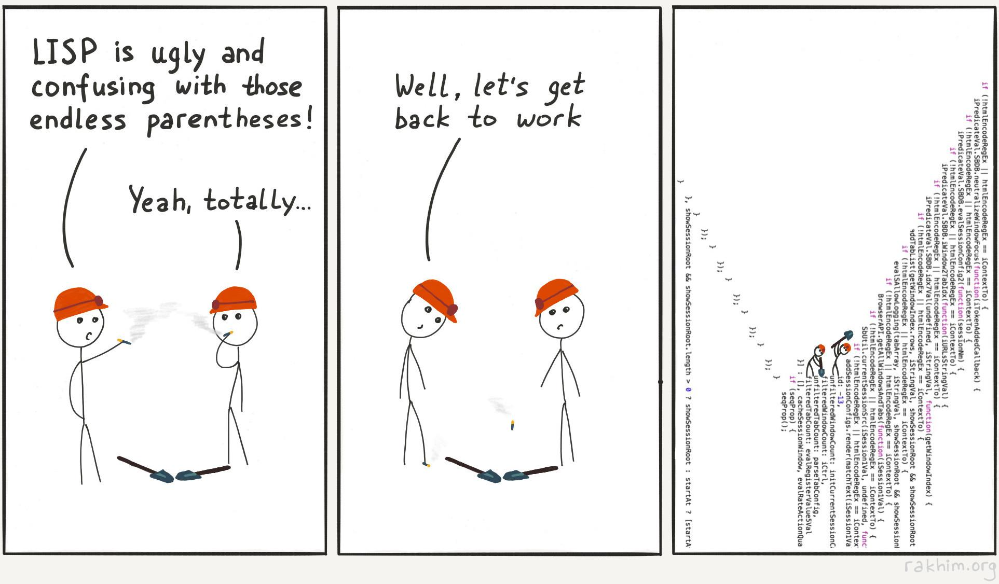

# 08. Графи. Отлагане на операции

---

Безсрамно откраднато (отново) от [миналата](https://github.com/triffon/fp-2022-23/blob/main/exercises/inf1/08-scheme-graph/README.md) [година](https://github.com/triffon/fp-2022-23/blob/main/exercises/inf1/09-scheme-stream/README.md) по модул форматиране :smile:

---

# Насочен граф:

Представяме "насочен граф" като асоциативен списък, в който ключовете са върховете, а стойностите са списъци от съседите на дадения връх.

## Задачи

Напишете следните функции:

1. `(graph? g)`, която проверява дали `g` е валиден насочен граф по горното описание

2. `(out-deg g x)`, която връща броя излизащи ребра от `x`

3. `(in-deg g x)`, която връща броя влизащи ребра в `x`

4. `(deg g x)`, която връща броят ребра, влизащи в или излизащи от `x`

5. `(max-deg g)`, която връща максималният брой влизащи/излизащи ребра от връх

6. (**БОНУС** 0.5т) `(edge? g x y)`, която проверява дали има ребро `x -> y`

7. (**БОНУС** 1т) `(path g x y)`, която връща някой път в `g`, започващ в `x` и завършващ в `y`. Ако няма такъв път, връща `#f`.

8. `(shortest-path g x y)`, която връща най-кратък път в `g`, започващ в `x` и завършващ в `y`. Ако няма такъв път, връща `#f`.

# Потоци

Под "потоци" разбираме структури от данни, които представят безкраен генератор на елементи.

За да имплементираме потоци, ни трябва концепция за лениво оценяване, която в scheme имплементираме чрез следните основни функции/макрота:

> [!NOTE]
> ще слагаме префикс `my-`, за да се диференцираме от библиотечните имплементации

- `(my-delay <израз>)` - връща promise обект, който кодира изчислението на `<израз>` в себе си
- `(my-force x)` - взима `promise` обекта x и връща резултата от изчислението, кодирано в него

Имайки този механизъм, можем да имплементираме потоци:

- `(my-stream-cons fst rst)` - създава поток с глава - резултата от израза `fst` и опашка - потокът, резултат от израза `rst`
- `(my-stream-first s)` - връща първия елемент на потока `s`
- `(my-stream-rest s)` - връща потока `s` без първия му елемент

## Задачи:

1. Дефинирайте константата `nats`, която е поток от всички естествени числа

2. Дефинирайте функцията `(stream-take s n)` която връща списък (не поток!) от първите n елемента на потока s.

3. Дефинирайте функцията `(stream-map f s)`, която връща поток от резултатите от прилагане на `f` върху елементите на потока `s`.

4. Дефинирайте функцията `(stream-filter p s)`, която връща поток, подобен на s, но само с елементите, за които е изпълнен предиката `p`

5. Използвайки резултатите от предните две задачи, дефинирайте константата `primes`, която е поток от всички прости числа

6. Дефинирайте константата `primes2`, която е поток от всички прости числа, и е имплементирана чрез безкрайно сито на Ератостен.

7. Дефинирайте функцията `(iterate f x)`, която по дадена функция `f` връща безкрайния поток `x`, `f(x)`, `f(f(x))`, ...
