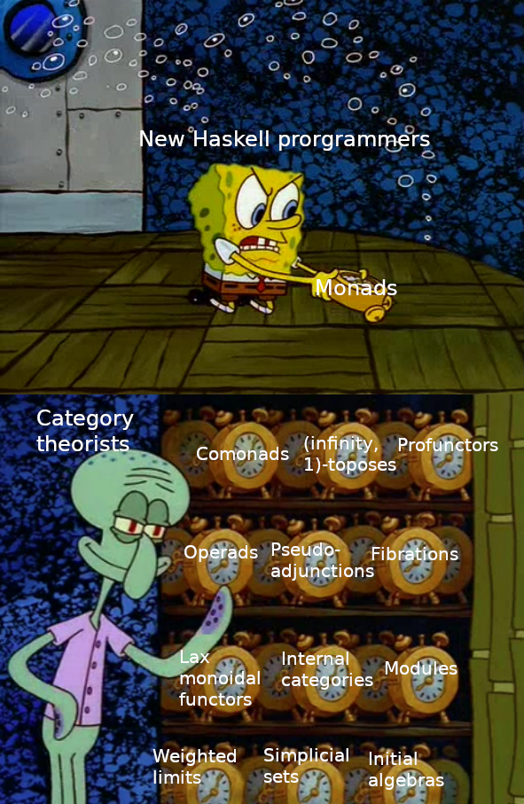

# 09. Въведение в Haskell



---

Може да си го турим е тва в началото на работния файл, че да кажем на ghc-то да ни псува смело

```haskell
{-# OPTIONS_GHC -fwarn-incomplete-patterns #-}     -- cover all cases!
{-# OPTIONS_GHC -fwarn-unused-matches #-}          -- use all your pattern matches!
{-# OPTIONS_GHC -fwarn-missing-signatures #-}      -- write all your toplevel signatures!
{-# OPTIONS_GHC -fwarn-name-shadowing #-}          -- use different names!
{-# OPTIONS_GHC -fwarn-incomplete-uni-patterns #-} -- warn about incomplete patterns v2
{-# OPTIONS_GHC -Werror #-}                        -- turn warnings into errors
```

---

## Типове

### Основни

- `Bool`

```haskell
True -- #t
False -- #f
```

- `Char`

```haskell
'a' 'b' -- #\a #\b
```

- `String`

```haskell
"Баница с боза"
```

- `Int` - цяло число

```haskell
[-2^29 .. 2^29-1]
```

- `Integer` - цяло число с неограничен размер (като числата в scheme)

```haskell
2^29
```

- `Float`, `Double`

```haskell
1.2 0.5
```

### Типове на функции

- `Int -> Char`
- `Int -> Int -> Int`

> [!NOTE]
> **Винаги** главна буква

### Типови параметри, параметрични типове

- `foo`, `bar`, `foo -> bar`, `banica`

> [!NOTE]
> **Винаги** малка буква

### Съставни типове

- `[foo]` - списък от `foo`-та
    - `[1, 2, 3] :: [Int]`

- `(foo, bar)` - tuple с първи елемент от тип `foo` и втори елемент от тип `bar`
    - `(1, pow) :: (Int, Float -> Float)`

- `String = [Char]`

### Дефиниране

- Константа:

```haskell
foo :: Int
foo = 42
```

- Функция:

```haskell
add :: Int -> Int -> Int
add x y = x + y
```

> [!NOTE]
> (Засега) ще четем типова от вида `а₁ -> a₂ -> ... -> aₙ -> b` като "функция, която взима `n` аргумента (от съответните типове `aᵢ`) и връща `b`". По-нататък ще разберем защо не пишем нещо като `(а₁, a₂, ..., aₙ) -> b`, а пък има толкова стрелкички (има добра причина)

### Основни конструкции

- `if`

```scheme
(if condition
  true_body
  false_body)
```

```haskell
if condition
then true_body
else false_body
```

- `cond`

```scheme
(define (f x)
  (cond
    [(> x 5) "banichka"]
    [(g x)   "sirene"]
    [else    "nqma"]))
```

```haskell
-- g :: Int -> Bool

f :: Int -> String
f x
  | x > 5     = "banichka"
  | g x       = "sirene"
  | otherwise = "nqma"
```

А ако знаем точни с какви стойности ще работим - можем дирекно да си дефинираме функцията за тях (вместо да им даваме име `x` и да проверяваме факти за него):

```haskell
isZero :: Int -> Bool
isZero 0 = True
isZero _ = False
```

Тук `0` и `_` са т.нар. **шаблони**, може да си мислим за тях като "част" от стойност (включително никаква или пълна част). `1` е шаблон за числа, който би "match"-нал само единици. `_` е специален шаблон, който match-ва всичко (мислете `else` в `cond`-а). След малко ще видим пример за шаблон "по средата" - да мачва повече от едно нещо, но да не е (само) `_`

- `lists`

```scheme
(cons 1 (cons 2 (cons 3 '())))
```

```haskell
1 : 2 : 3 : []
1 : 2 : [3]
1 : [2, 3]
[1, 2, 3]

# Можем да кажем

cons :: a -> [a] -> [a]
cons x xs = x : xs

empty_tuple :: [a]
empty_tuple = []

car :: [a] -> a
car = head

cdr :: [a] -> [a]
cdr = tail
```

> [!NOTE]
> Както при `scheme`, така и тук списък наричаме или "наредена двойка" от нещо списък (`:`) или константата "празен списък" (`[]`). Разликата е, че тук също можем да разглеждаме изчерпателно случаите (вместо само да пускаме `car`/`cdr`)

```scheme
(define (sum-list-int l)
  (if (null? l)
    0
    (+ (car l)
       (sum-list-int (cdr l)))))
```

```haskell
sumListInt :: [Int] -> Int
sumListInt [] = 0
sumListInt (x : xs) = x + sumListInt xs
```

## Задачи

Имплементирайте следните функции:

1. `fact n` изчислява факториел от `n`

```haskell
fact :: Int -> Int
fact = undefined
```

2. `fib n` изчислява `n`-тото число на фибоначи

```haskell
fib :: Int -> Int
fib = undefined
```

3. `myAbs n` изчислява модул от `n`

```haskell
myAbs :: Int -> Int
myAbs = undefined
```

4. `composeInt f g` връща функция, която е композицията на едноаргументните функции върху цели числа `f` и `g`

```haskell
composeInt :: (Int -> Int) -> (Int -> Int) -> (Int -> Int)
composeInt = undefined
```

5. (**Бонус**: 1т.) `compose`, която е като `composeInt`, но работи за произволни входни данни (измислете типа)

```haskell
compose :: _
compose = undefined
```

6. (**Бонус**: 1т.) `myConcat` съединява два списъка

```haskell
myConcat :: [a] -> [a] -> [a]
myConcat = undefined
```

7. `isIntPrefix` проверява дали първият подаден списък е префикс на втория

```haskell
isIntPrefix :: [Int] -> [Int] -> Bool
isIntPrefix = undefined
```

8. (**Бонус**: 1т.) `isPrefix` работи като `isIntPrefix`, но за произволни[^1] входни данни

```haskell
isPrefix :: (Eq a) => [a] -> [a] -> Bool
isPrefix = undefined
```

[^1]:
> [!NOTE]
> Pay no mind на `(Eq a) =>`, по-късно ще говорим какво точно означава. Засега е важно само да знаем, че това ни позволява да ползваме функцията `==`, че да сравняваме `a`-та

9. `repeat n f x` е резултата от прилагането на `f` върху `x` `n` пъти

```haskell
frepeat :: Int -> (a -> a) -> a -> a
frepeat = undefined
```

10. (**Бонус**: 1т.) `repeat n f` връща функция, която действа като `n` пъти прилагане на `f` (измислете типа)

```haskell
frepeated :: _
frepeated = undefined
```
