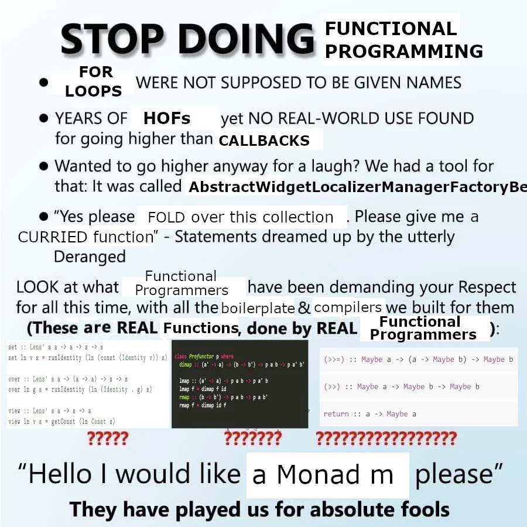

# 13. Monads, IO, Programs



---

Напомнянка за [Блиц Тест 4](https://learn.fmi.uni-sofia.bg/mod/quiz/view.php?id=287044), който е до довечера (23:00)

---

Както може би се усетихте миналият път, типовете на функциите в последните задачки изглеждат подозрително подобни, а именно:

```haskell
pureMaybe'  :: a -> Maybe'    a
pureEither' :: a -> Either' e a
pureList'   :: a -> List'     a

flattenMaybe'  :: Maybe'    (Maybe'    a) -> Maybe'    a
flattenEither' :: Either' e (Either' e a) -> Either' e a
flattenList'   :: List'     (List'     a) -> List'     a

andThenMaybe'  :: Maybe'    a -> (a -> Maybe'    b) -> Maybe'    b
andThenEither' :: Either' e a -> (a -> Either' e b) -> Either' e b
andThenList'   :: List'     a -> (a -> List'     b) -> List'     b
```

Това подобие изразяваме чрез типовият клас `Monad`:

```haskell
class Monad m where
  return :: a -> m a
  (>>=) :: m a -> (a -> m b) -> m b
```

`pure` от миналият път съответства на `return`, а `andThen` на `(>>=)`

> [!NOTE]
> `return` е просто име на функция, по-долу ще видим защо ѝ е дадено такова примамливо име

> [!NOTE]
> В реалност `Monad` "наследява" още два типови класа, а именно `Functor` и `Applicative`.
>
> ```haskell
> class Functor f where
>   fmap :: (a -> b) -> f a -> f b
>
> class Functor f => Applicative f where pure :: a -> f a
>   (<*>) :: f (a -> b) -> f a -> f b
>
> class Applicative m => Monad m where
>   return :: a -> m a
>   (>>=) :: m a -> (a -> m b) -> m b
> ```
> Нямаме време да навлезнем в детайли той с какво `Applicative` е повече от `Functor` и с какво е по-малко от `Monad`, тъй че за нас `Monad` ще е просто "`Functor` с бонуси"
> Понеже е по-слаб от `Monad`, то можем да му дадем "автоматични" дефиниции, изведени от `Monad` функционалността:
> ```haskell
> instance Functor MyType where
>   fmap = undefined
>
> instance Applicative MyType where
>   pure  = return -- from Monad instance
>   (<*>) = ap     -- from Monad instance
>
> instance Monad MyType where
>   return = undefined -- actual implementation
>   (>>=)  = undefined -- actual implementation
> ```

Типът на оператора `(>>=)` (четем `bind`) изглежда малко станно, може да го гледаме като нещо като `flatMap` (`flatten` след `map`):

```haskell
-- flatten от миналият път
join :: Monad m => m (m a) -> m a

-- от Functor
fmap :: Functor f => (a -> b) -> f a -> f b

(>>=) :: Monad m => m a -> (a -> m b) -> m b
ma >>= famb = join (fmap famb ma)

-- Всяко `a` в `m a` става на `m b`
-- >>> :t fmap famb ma
-- m (m b)
```

Задачката за `safeDiv2` и `safeDiv4` от миналият път можем да изразим ей така:

```haskell
safeDiv2 :: Int -> Maybe Int
safeDiv2 n =
  if even n
  then Just $ n `quot` 2
  else Nothing

safeDiv4 :: Int -> Maybe Int
safeDiv4 n = case safeDiv2 n of
  Nothing -> Nothing
  Just m -> case safeDiv2 m of
    Nothing -> Nothing
    Just k -> Just k
```

Оказва се, че можем това да го изразим чрез `flatMap`-ове:

```haskell
safeDiv4 :: Int -> Maybe Int
safeDiv4 n =
  safeDiv2 n >>= \m ->
  safeDiv2 m >>= \k ->
  return k
```

`Haskell` ни позволява да пишем подобно изглеждащ използвайки малко синтактична захар:

```haskell
safeDiv4 :: Int -> Maybe Int
safeDiv4 n = do
  m <- safeDiv2 n
  k <- safeDiv2 m
  return k
```

> [!NOTE]
> Напомня ли ви това на list comprehensions?

След толкова много борба дойде време да напишем един "Hello World" на `Haskell`:

```haskell
main :: IO ()
main = putStrLn "Hello World"
```


Допълнително в `do` можем да `let`-ваме с имплицитно тяло (демек без `in`) до края на `do`-блока:

```haskell
banica :: IO ()
banica = do
  let message = "Banica"
  putStrLn $ "Hello " ++ message
```

Защо не може да кажем `message <- "Banica"`? Какво трябва да направим, че да можем?

> [!IMPORTANT]
> Live coding time, ще покажем какво е `IO`, какъв му е смисълът, защо и как е `Monad`
> `getLine`, `putStrLn`, `readFile`, `fail`

# Задачи

Задачи взаимстваме от миналият път, ама този път ще ползваме `do`-синтаксис, че да ги решим

1. (**БОНУС** 0.5т.) Дефинирайте функция `hop :: [Maybe a] -> Maybe [a]`

```haskell
hop [Just 2, Just 3, Just 4] == Just [2, 3, 4]
hop [Just 2, Nothing, Just 4] == Nothing
```

2. (**БОНУС** 0.5т.) Дефинирайте програма `cat :: IO ()`, която да имитира POSIX командата `cat` (когато е без аргументи), а именно - да принтира всеки въведен ред

3. (**БОНУС** 0.5т.) Дефинирайте функция `readMatrix :: IO [[Int]]`, която прочита две числа `n` и `m` (на отделни редове) и след това `m` пъти чете по `n` числа на ред, събирайки резултатите в списък от списъци `[[Int]]` (hint: `Hoogle`-нете си `words`, `read`)
