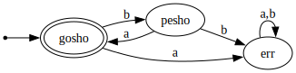

## Автомати и низове

### Автомати
Ще си измислим структура от данни, представяща краен автомат.
Тя ще представлява асоциативен списък с три елемента - `delta`,
`start` и `final`.

Стойността зад ключа `delta` наричаме "функция на преходите",
и тя сама по себе си е асоциативен списък.
Ключовете на функцията на преходите са двойки, където:

- първият елемент на двойката-ключ е име на състояние
- вторият елемент на двойката-ключ е буква (символ)
- стойността е име на друго състояние

Всеки елемент на `delta` описва преход от състояние с някоя буква
в друго състояние.

Стойността зад ключа `start` е името на началното състояние.
Стойността зад ключа `final` е списък от имената на финалните състояния.

Например, така може да представим автомат, разпознаващ езика `(ba)*`:

```scheme
(define baba-automaton
  (list
   (cons 'delta
         (list
            (cons (cons 'gosho 'b) 'pesho)
            (cons (cons 'gosho 'a) 'err)
            (cons (cons 'pesho 'b) 'err)
            (cons (cons 'pesho 'a) 'gosho)
            (cons (cons 'err 'a) 'err)
            (cons (cons 'err 'b) 'err)))

   (cons 'start 'gosho)
   (cons 'final (list 'gosho))))
```



- Зад. 1: Напишете функция `(apply-delta delta state symb)`, която по подадени
функция на преходите, състояние и буква връща следващо състояние

- Зад. 2: Напишете функция `(apply-delta* delta state word)`, която по подадени
функция на преходите, състояние и списък от букви връща следващо състояние,
което се получава като извършим преходите за всички букви в списъка

- Зад. 3: Напишете функция `(accepts-word? automaton word)`, която по подадени
автомат връща `#t` или `#f`, в зависимост от това дали автоматът разпознава думата

Пример:
```scheme
(accepts-word? baba-automaton '(b a b a)) --> #t
(accepts-word? baba-automaton '(b a b)) --> #f
```

- Зад. 4: След като минете следващата тема (низове), се върнете на тази задача
и променете представянето на автомат от по-горе, така че вместо символи и списъци от символи
да използва графеми и низове
