# How to install Haskell

## Step 0 ❗

❗❗❗ If you have a **third-party** antivirus (i.e. different from Windows Defender), please **turn it off** until you complete this procedure. ❗❗❗

## Steps 1 and 2

Navigate to [the official Haskell website](https://www.haskell.org/) and click on `Downloads`:

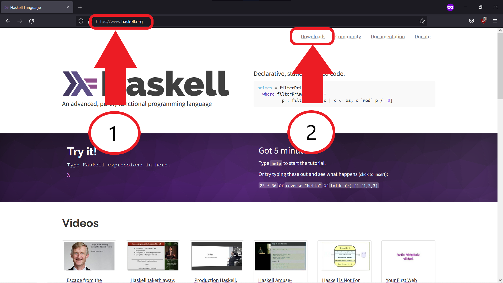

## Step 3

Click on the `GHCup` link:

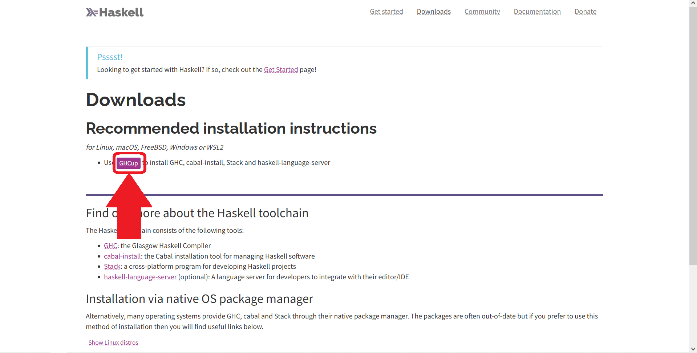

## Step 4

Copy the command which will install the utility with which Haskell can be set up:

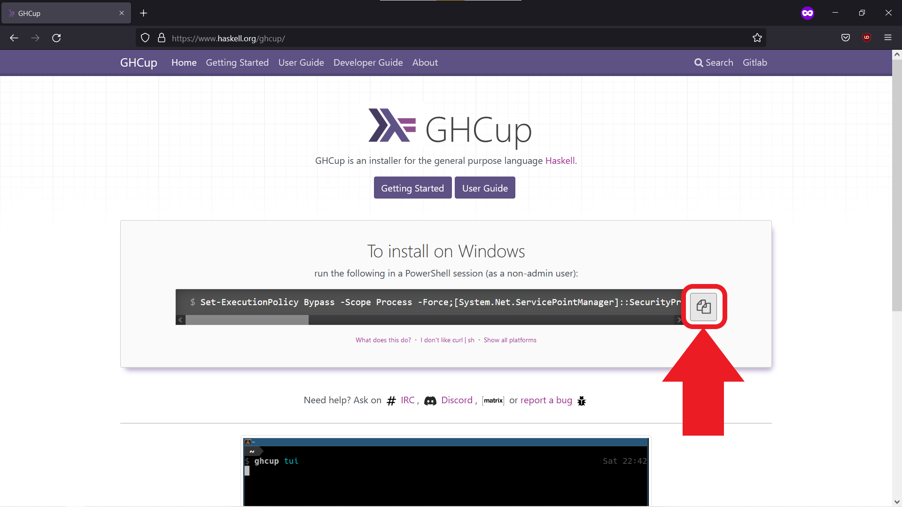

## Step 5

Open Powershell and paste the command using `Cntr + V`:

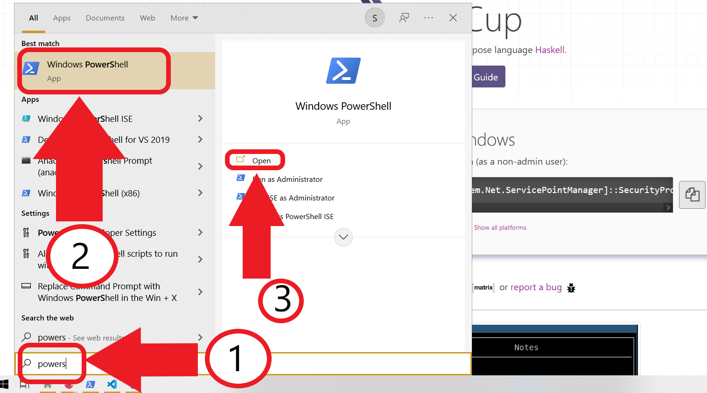

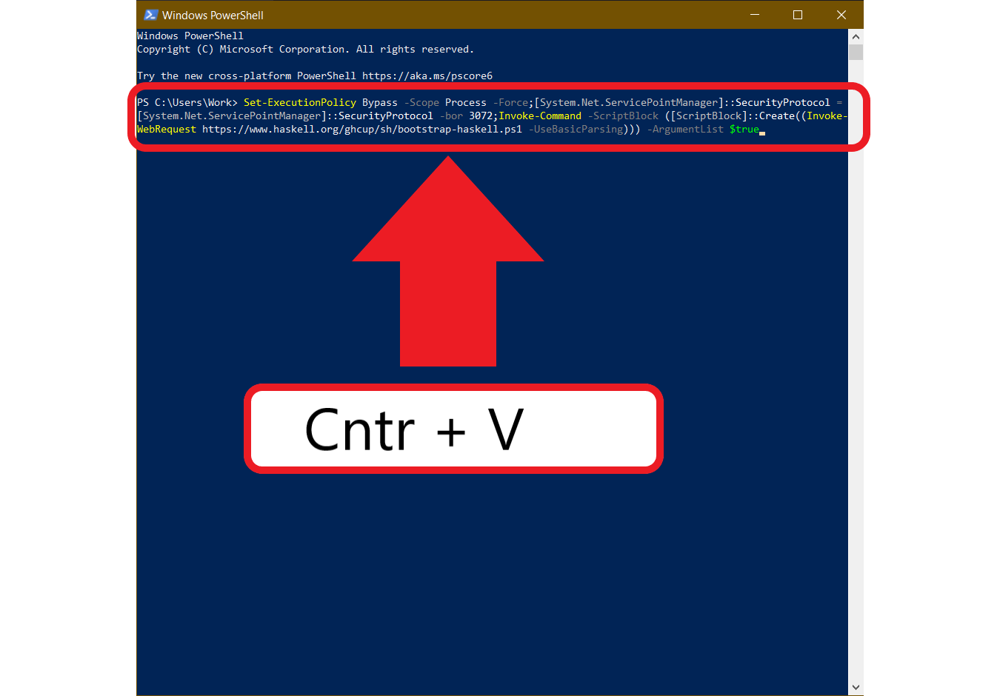

## Step 6

Accept the default answers for installing the Haskell toolchain:

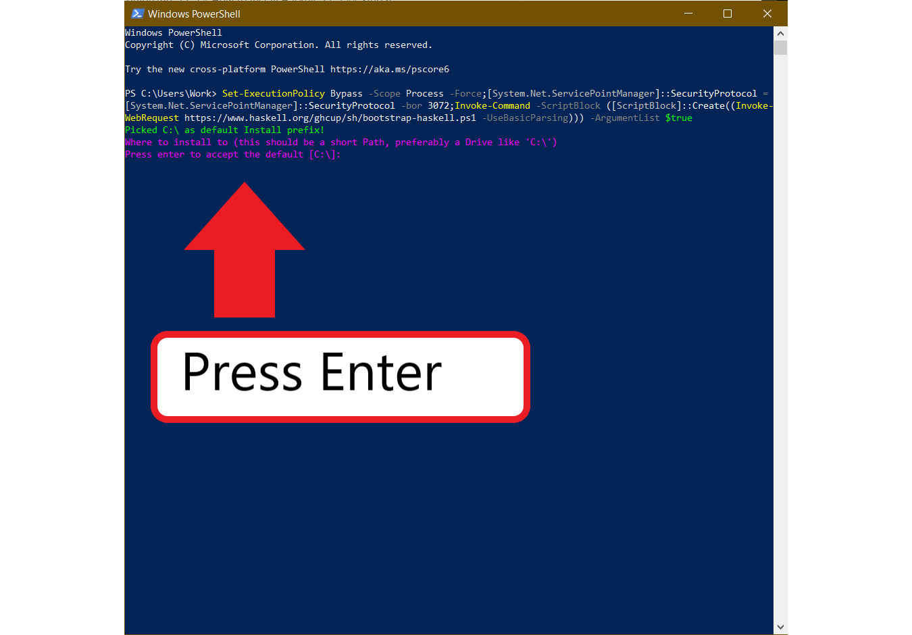

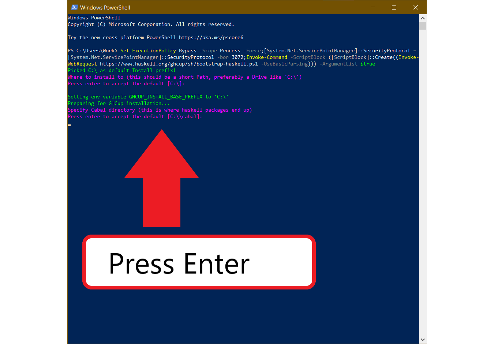

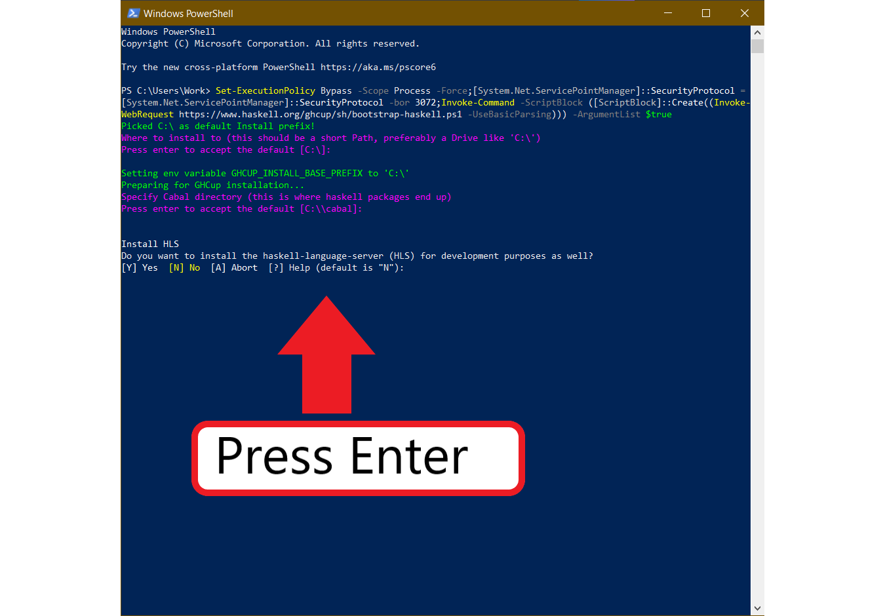

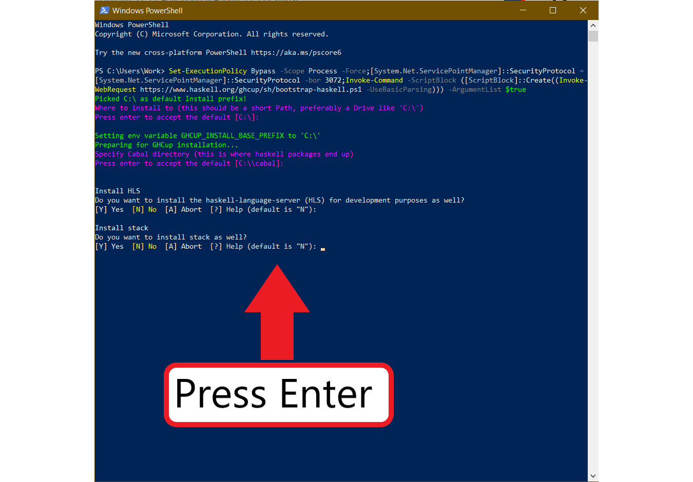

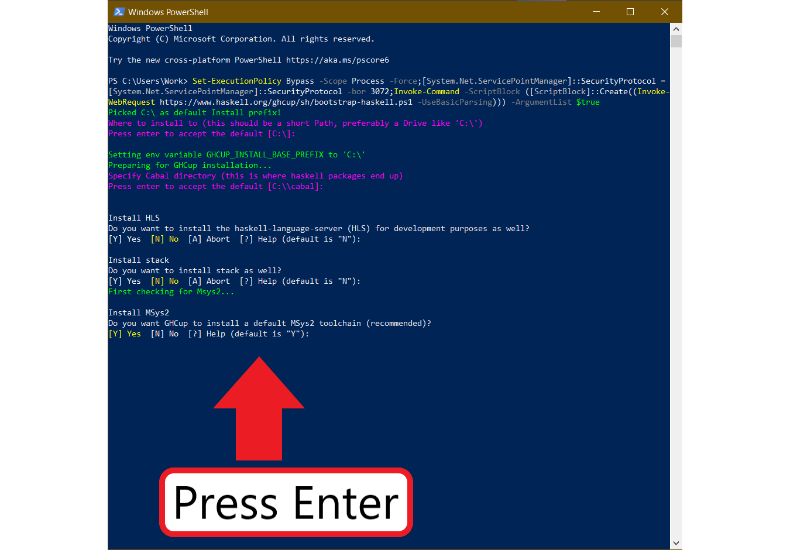

This will start the installation procedure. It is going to take some time. Do not close the window until it has finished.

If get an error the first time you run the command, then paste and run it again. This time you should get a prompt asking you whether you want to reinstall cabal. You should reinstall it, by entering `R` when the prompt appears. If the installation fails again, drop me an email.

## Step 7

After around 2-5 mins (depending on the speed of your Internet connection) you should see another window open:

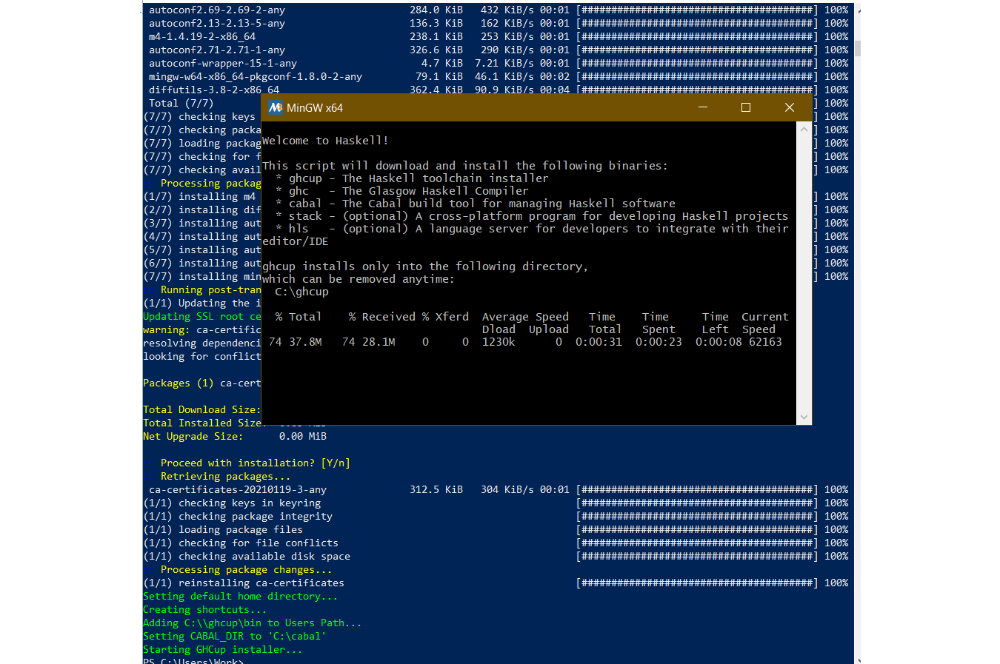

This is also part of the installation and you must also wait for it to finish. It is going to take around 10-20 mins (depending on the speed of your Internet connection).

If the installation was successful, you should see the following text:

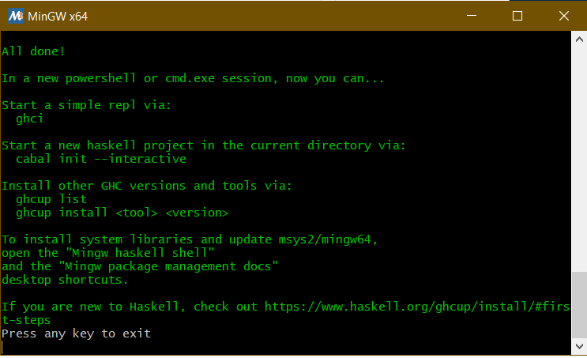

You can press `Enter` and close all opened windows.

## Step 8

Let's test to see if it works. Go to [the official Visual Studio Code website](https://code.visualstudio.com/) and download the editor (if you don't have it already).

After installation open it and install the following extensions:
- Code Runner
- Haskell Syntax Highlighting

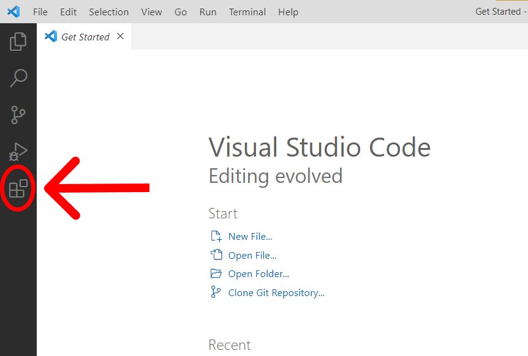

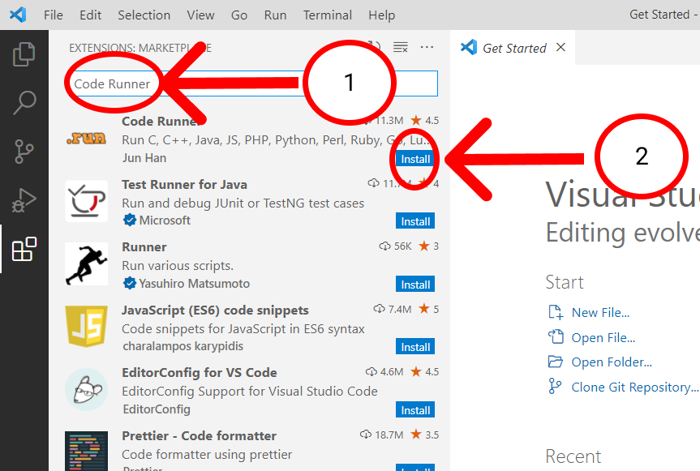

Do the same for *Haskell Syntax Highlighting*:

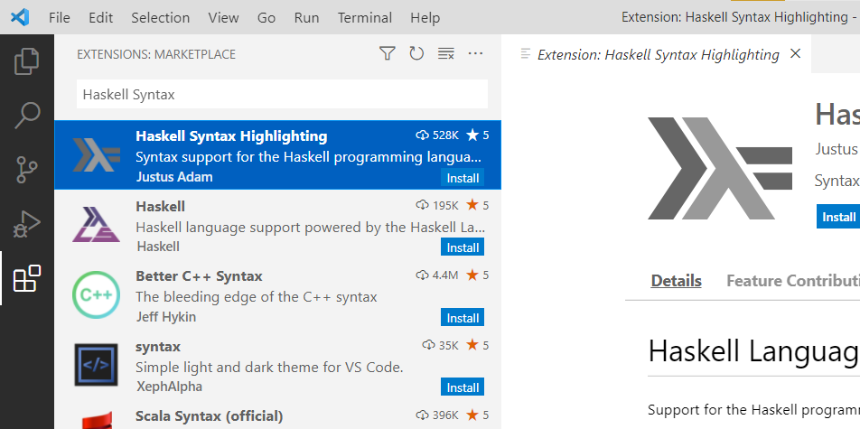

Now create a new file and save it as *test.hs*. In it paste the following code:

```haskell
main :: IO()
main = do
    print "Hello, world"
```

**Save the file** and click on the *Play* button in the top right corner. Your program should ouput "Hello, world"!

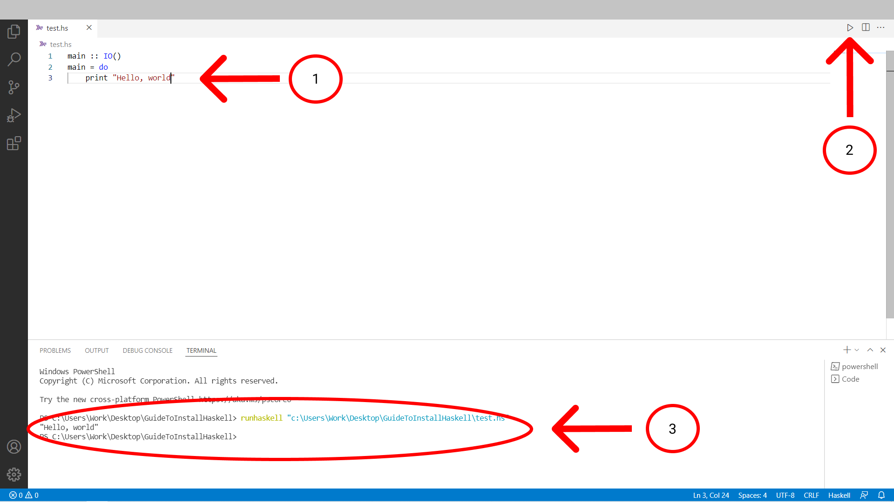

Congratulations! You have successfully prepared your machine for programming in Haskell 🥳 !

**Credit: Simeon Hristov**
